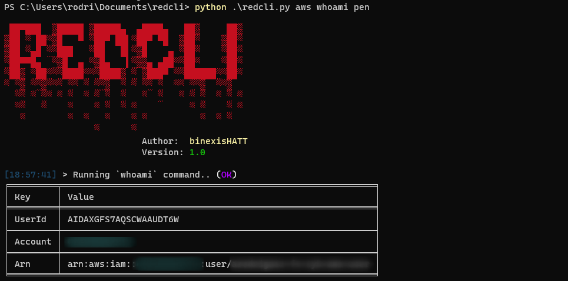

# redcli

`redcli` is an AWS cloud penetration testing tool.



### AWS Help Menu

```bash
% python redcli.py aws --help          


 ██▀███  ▓█████ ▓█████▄  ▄████▄   ██▓     ██▓
▓██ ▒ ██▒▓█   ▀ ▒██▀ ██▌▒██▀ ▀█  ▓██▒    ▓██▒
▓██ ░▄█ ▒▒███   ░██   █▌▒▓█    ▄ ▒██░    ▒██▒
▒██▀▀█▄  ▒▓█  ▄ ░▓█▄   ▌▒▓▓▄ ▄██▒▒██░    ░██░
░██▓ ▒██▒░▒████▒░▒████▓ ▒ ▓███▀ ░░██████▒░██░
░ ▒▓ ░▒▓░░░ ▒░ ░ ▒▒▓  ▒ ░ ░▒ ▒  ░░ ▒░▓  ░░▓  
  ░▒ ░ ▒░ ░ ░  ░ ░ ▒  ▒   ░  ▒   ░ ░ ▒  ░ ▒ ░
  ░░   ░    ░    ░ ░  ░ ░          ░ ░    ▒ ░
   ░        ░  ░   ░    ░ ░          ░  ░ ░  
                 ░      ░
                          Author:  binexisHATT
                          Version: 1.0

Usage: redcli.py aws [OPTIONS] COMMAND [ARGS]...

Options:
  --help  Show this message and exit.

Commands:
  check-mfa                       Check if MFA is enabled for the...
  dump-buckets                    Dump content for all S3 buckets
  get-instance-access-token       Get instance credentials via Instance...
  get-instance-profiles           List all instance profiles
  get-security-groups             List all Ec2 instances security groups
  get-user-data                   Get an instances user-data script
  launch-ec2-with-instance-profile
                                  Launch an Ec2 instance and attach...
  list-buckets                    List all S3 buckets if allowed
  list-iam-permissions            List permissions associated with profile
  list-s3-acls                    List all S3 bucket Access Control Lists...
  user-data-rev-shell             Obtain a reverse shell via user-data...
  whoami                          Get IAM identity associated with tokens
```

# Run

> Dependencies: python3, python3-pip

```bash
git clone https://github.com/binexisHATT/redcli.git
cd redcli
pip3 install -r requirements.txt
python3 redcli.py aws --help
```

# Run with Docker

> Dependencies: docker.io

```bash
git clone https://github.com/binexisHATT/redcli.git
docker build --tag=redcli .
docker run -it --entrypoint=/bin/bash redcli
python3 redcli.py aws --help
```
